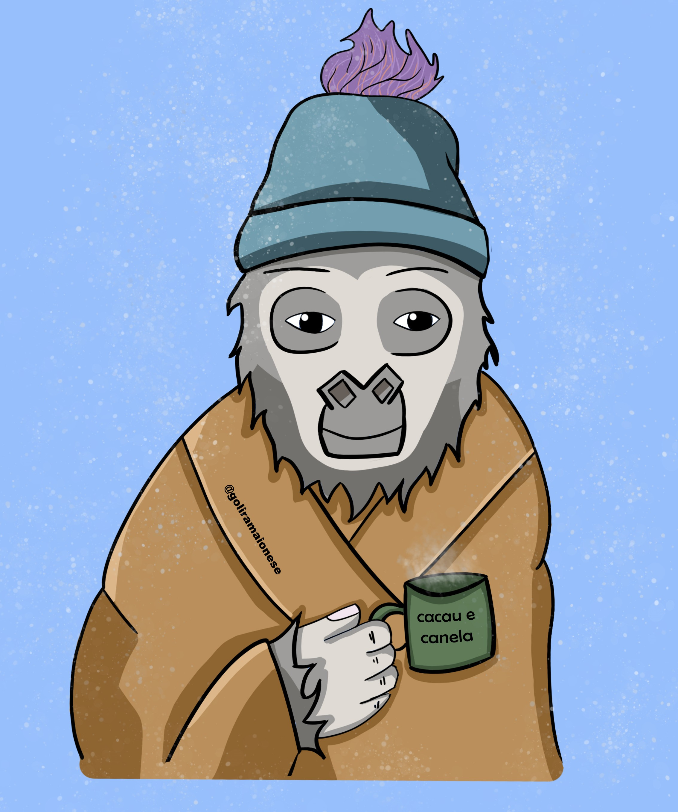

## Olá, tudo bom ? Sou o Marco Mecenas Filho e seja Bem-vindo(a) ao  meu GitHub;

#### Estou migrando para área de Tecnologia. Venho da  pesquisa ciêntifica,  mais especificamenta da Química Medicinal Computacional {<a href="https://www.linkedin.com/in/marcomecenasfilho/" target="_blank">:mortar_board:</a>} . Sempre fui apaixonado por novas tecnologias, e agora estou estudando para ser um web developer Full-Stack;

## Projeto de maior orgulho{<a href="https://github.com/MarcoMecenasFilho/receitasshowshow" target="_blank">:trophy:</a>}

### Sinta-se em casa.  Qualquer coisa estou aqui para ajudar!

  <a href="https://github.com/MarcoMecenasFilho">
  

  
 
  
  
  

  ##

 
   
  
   
     

